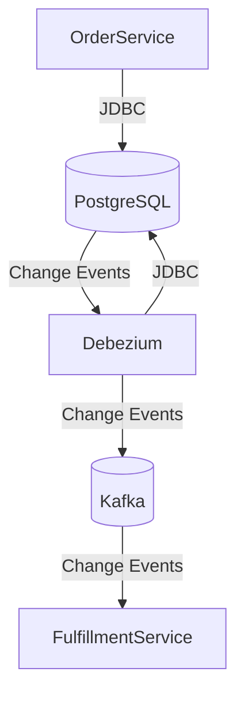

# spring-poc-postgres-debezium
This is a proof of concept Change Data Capture using Debezium and PostgreSQL 

Following diagram shows a quick overview of the architecture:



## Prerequisites

- Docker Compose
- Java 21

## How to run

1. Start the services using docker-compose

```shell
docker-compose up
```

2. Start the Order Service

```shell
./gradlew bootRun
```

## Note

Kafka [cluster setup](https://github.com/apache/kafka/blob/trunk/docker/examples/docker-compose-files/cluster/isolated/plaintext/docker-compose.yml) is taken from official Kafka Docker image repository. See [Multi Node Cluster/Isolated](https://github.com/apache/kafka/tree/trunk/docker/examples#multi-node-cluster) section for more details.