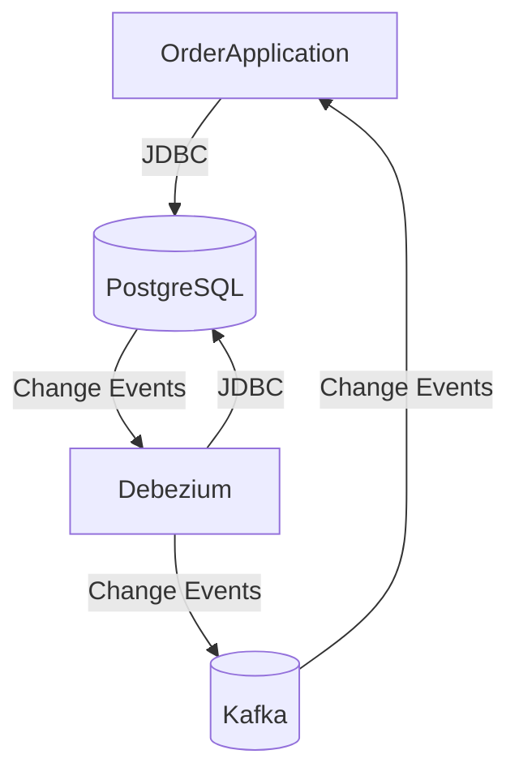

# spring-poc-postgres-debezium
This is a proof of concept Change Data Capture using Debezium and PostgreSQL 

Following diagram shows a quick overview of the architecture:

In real world scenarios we have multiple microservices that are dependent on the data that is being produced by other microservices. 
In such scenarios, we need to have a mechanism to notify the dependent microservices about the changes in the data. This is where Change Data Capture (CDC) comes into picture. CDC is a design pattern that captures changes in the data and makes them available in a form that can be consumed by other systems. 
