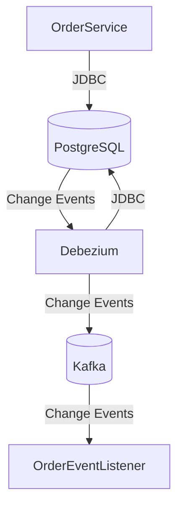
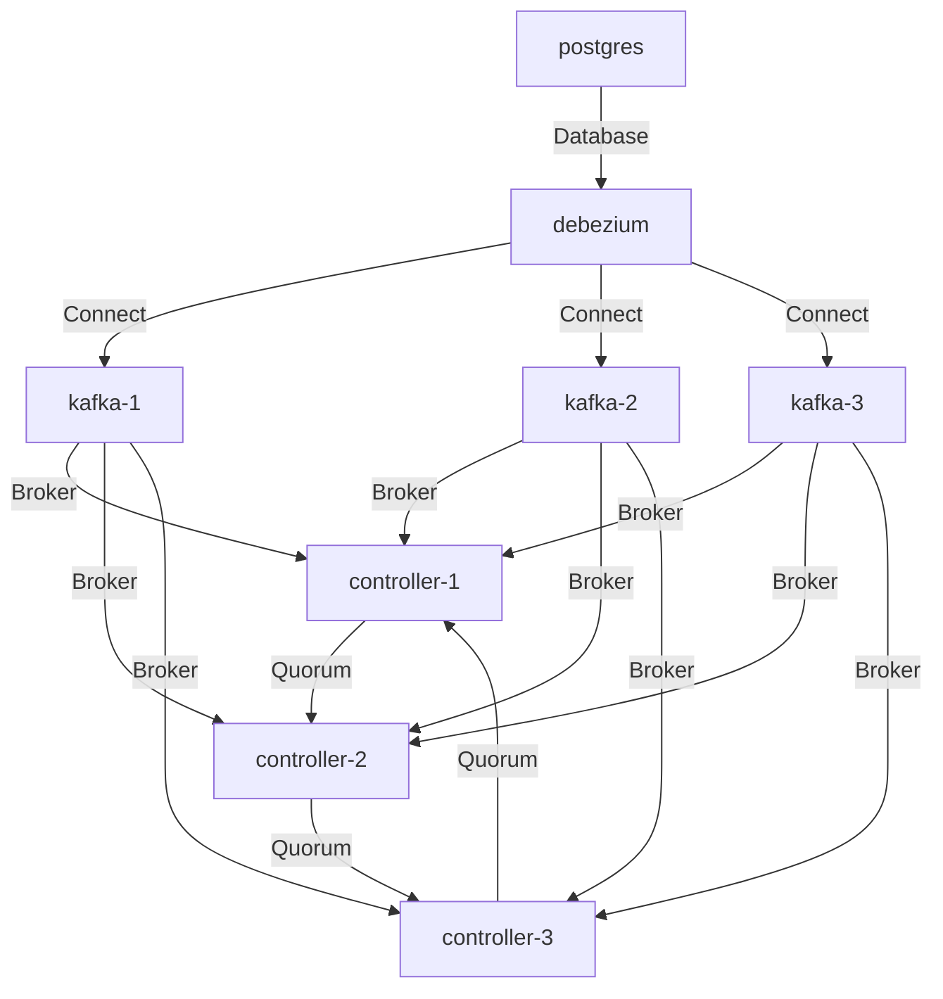

# spring-poc-postgres-debezium
This is a proof of concept Change Data Capture using Debezium and PostgreSQL.

## Architecture



## Components



## Requirements to Run 

You need to have the following installed on your machine:

- Docker
- Java 21
- Gradle 
- curl

## How to run

1. Start the services using docker-compose

```shell
docker-compose up
```

2. Start the Order Service

```shell
./gradlew bootRun
```

3. Configure Debezium Connector

Use [http/DebeziumConnector.http](http/DebeziumConnector.http) collection to create a Debezium connector.

Alternatively, you can use the following command to create a Debezium connector:

```shell
curl -i -X POST -H "Accept:application/json" -H "Content-Type:application/json" localhost:8083/connectors/ -d '{
   "name": "order-connector",
   "config": {
     "connector.class": "io.debezium.connector.postgresql.PostgresConnector",
     "tasks.max": "1",
     "database.hostname": "postgres",
     "database.port": "5432",
     "database.user": "postgres",
     "database.password": "postgres",
     "database.dbname": "orderdb",
     "database.server.name": "orderdb_server",
     "plugin.name": "pgoutput",
     "slot.name": "debezium_slot",
     "publication.name": "order_publication",
     "publication.autocreate.mode": "filtered",
     "schema.include.list": "orderdb",
     "table.include.list": "orderdb.order",
     "topic.prefix": "cdc"
   }
 }'
```

# Examples 

Use [http/OrderApplication.http](http/OrderApplication.http) collection to create/update/delete orders and observe incoming CDC events in Logs.

Alternatively, you can use the following curl commands: 

## Create an order

```shell
curl -X POST -H "Content-Type: application/json" -d '{
    "customerName": "Omer Kocaoglu",
    "customerEmail": "omersw@email.com",
    "customerAddress": {
        "street": "1234 Elm St",
        "city": "Springfield",
        "state": "IL",
        "zip": "62701"
    }
}' http://localhost:8081/order-api/orders
```

## Update an order
    
```shell
curl -X POST -H "Content-Type: application/json" -d '{
    "customerName": "Omer Kocaoglu",
    "customerEmail": "e@mail.com",
    "customerAddress": {
        "street": "1234 Elm St",
        "city": "Springfield",
        "state": "IL",
        "zip": "62701"
    },
    "status": "FULFILLED"
    }' http://localhost:8081/order-api/orders/6d2c4d98-5aa6-4340-80d8-d737cadea2c6
```

## Delete an order

```shell
curl -X DELETE http://localhost:8081/order-api/orders/6d2c4d98-5aa6-4340-80d8-d737cadea2c6
```

# Debezium Monitoring

## Get health check
```shell
curl -X GET http://localhost:8083/
```

## List all connectors
```shell
curl -X GET http://localhost:8083/connectors
```

## Get connector status
```shell
curl -X GET http://localhost:8083/connectors/order-connector/status
```

## Get connector config
```shell
curl -X GET http://localhost:8083/connectors/order-connector/config
```

## Get connector topics
```shell
curl -X GET http://localhost:8083/connectors/order-connector/topics
```

See [Debezium Monitoring](https://debezium.io/documentation/reference/stable/connectors/postgresql.html#postgresql-monitoring) for more details.

## Kafka 

Kafka [cluster setup](https://github.com/apache/kafka/blob/trunk/docker/examples/docker-compose-files/cluster/isolated/plaintext/docker-compose.yml) is taken from official Kafka Docker image repository. See [Multi Node Cluster/Isolated](https://github.com/apache/kafka/tree/trunk/docker/examples#multi-node-cluster) section for more details.
